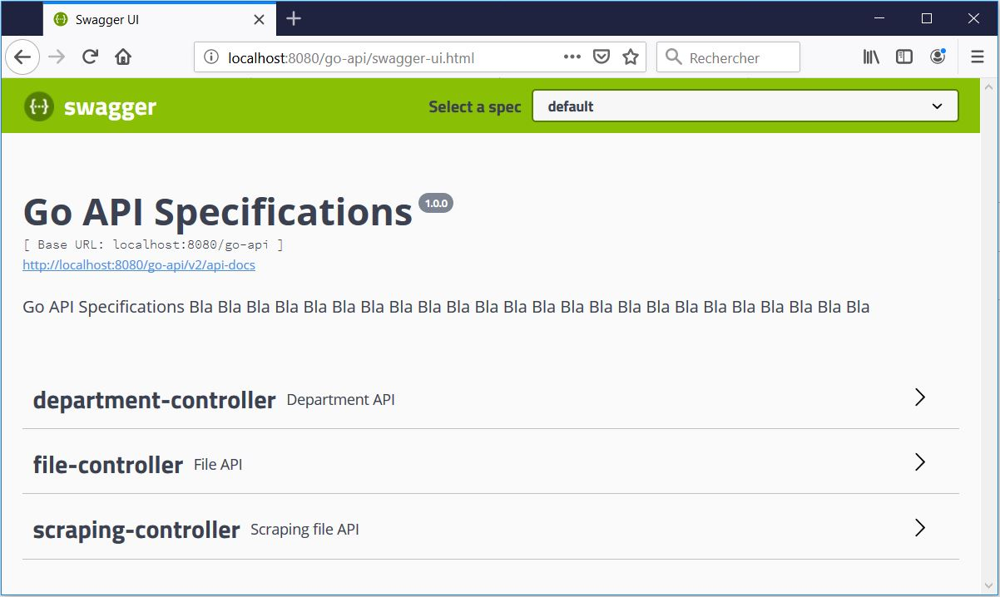

# MOP installation sur une nouvelle instance


NOTE : les items de la TODO ci-aprés sont détaillés dans cette documentation
* [ ] Créer la base de données [(voir chapitre relatif)](#cr%C3%A9ation-de-la-base-de-donn%C3%A9es)


# Configuration de l'application

## Base de données

### Création de la base de données

La base de données doit être créé sur l'environnement cible via ces commandes : 

```sql
CREATE USER runner WITH PASSWORD 'password';
```

```sql
CREATE DATABASE runner_db WITH OWNER = runner ENCODING = 'UTF8' TABLESPACE = pg_default CONNECTION LIMIT = -1;
```
### API Documentation avec Swagger

Pour documenter correctement les endpoints disponibles de l' API, ce qu'ils peuvent faire, les paramètres d'entrée dont ils ont besoin et ce qu'ils fourniront en sortie. Swagger est un standard populaire utilisé à cette fin.

Après avoir exécuté l'application, accédez à http://localhost:8080/go-api/swagger-ui.html

